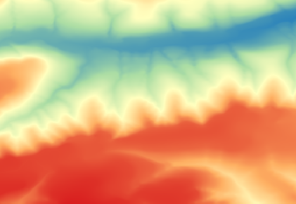

# DEM Service API

The US Geological Survey provisions a 10 by 10 meter digital elevation map of the entire United States, which can be publicly downloaded for use. The map is divided into approximately 1383, 88x88 km tiles, each about 300-500 MB in size. The idea behind the DEM Service is to be able to clip an area of interest to the DEM and return the information as a raster to the user. Similar to HLS Service, the API could be used by the website and for model training and prediction. 

The DEM rasters are currently stored as COG files in Azure blob storage where they can easily be accessed using a range reading system by the API. When a user passes a field boundary, the coordinates are used to clip a tile in blob storage to the shape of the field much faster than if the entire tile needed to be downloaded for processing.

## Example
Below is an example POST request with the corresponding imagery that is generated by the service.

    {
    "aoi": "{\"type\":\"Feature\",\"geometry\":{\"type\":\"Polygon\",\"coordinates\":[[[-121.2475204, 45.4668127],[-121.2484646, 45.4418262],[-121.2119007, 45.4417660],[-121.2115574, 45.4665117],[-121.2475204, 45.4668127]]]}}",
    "Elevation_Index": "False"
    }

The response from the POST request.

    {'Features': [
    {'attributes': {
    	'CellSize': [9.259259269220297e-05, -9.259259269220297e-05], 'CoordinateSystem': 'GEOGCS["WGS 84",DATUM["WGS_1984",SPHEROID["WGS 84",6378137,298.257223563,AUTHORITY["EPSG","7030"]],AUTHORITY["EPSG","6326"]],PRIMEM["Greenwich",0],UNIT["degree",0.0174532925199433],AUTHORITY["EPSG","4326"]]', 
    	'Extent': '-76.4984894, 42.44091207776192, -76.47552643701233, 42.455634299999986', 
	    'Legend': [
	    	{'Area': '20.0 %', 
	    	'Count': 7727, 
	    	'CountAllPixels': 38633, 
	    	'Max': 135.21997985839846, 
	    	'Mean': 125.7345054626465, 
	    	'Min': 116.24903106689453, 
	    	'color': '#ff0000'}, 
	    	{'Area': '20.0 %', 
	    	'Count': 7726, 
	    	'CountAllPixels': 38633, 
	    	'Max': 197.05475158691405, 
	    	'Mean': 166.13736572265626, 
	    	'Min': 135.21997985839846, 
	    	'color': '#ff7f50'}, 
	    	{'Area': '20.0 %', 
	    	'Count': 7727, 
	    	'CountAllPixels': 38633, 
	    	'Max': 233.81890258789065, 
	    	'Mean': 215.43682708740235, 
	    	'Min': 197.05475158691405, 
	    	'color': '#aaa935'}, 
	    	{'Area': '20.0 %', 
	    	'Count': 7726, 
	    	'CountAllPixels': 38633, 
	    	'Max': 251.50924682617188, 
	    	'Mean': 242.66407470703126, 
	    	'Min': 233.81890258789065, 
	    	'color': '#55d41a'}, 
	    	{'Area': '20.0 %', 
	    	'Count': 7726, 
	    	'CountAllPixels': 38633, 
	    	'Max': 277.3252868652344, 
	    	'Mean': 264.4172668457031, 
	    	'Min': 251.50924682617188, 
	    	'color': '#00ff00'}], 
    	'Matrix': [159, 248], 
    	'Max': 277.3252868652344, 
    	'Mean': 202.54037475585938, 
    	'Min': 116.24903106689453, 
    	'OID': 0, 
    	'Percentile5': 119.83101501464844, 
    	'Percentile95': 266.0197509765625, 
    	'Std': 51.61872185919568, 
    	'Variety': 'NoVariety', 
    	'pngb64': 'data:image/png;base64, iVBORw0KGgoAAAANSUhEUgAAAPgAAACfCAYAAADUIBTpAAAIcUlEQVR4nO3dQXKcSBBG4WzHXEEb9Q0sHWY2nGdiztMbX6Z1A2vjQ3gWMmOEaSigoPLPfN/KEXZYtKIfVUABl59mP0zMxeyp9TYACi5Sgf/zd+stKHL7+r31Jtjtpc423F7f2ZkK0wlcJG4zH4H3aoXuze3lvfUm1HepPzPVCFwo7p6nyJco7gRCBn4AAj+QUuQ9pdiJfJn/wIm7KYXgCf0x34GLxm0WJ3AzjciXZN0JfGm9AQ8Jxw1fssZtZvZX6w2YRNwuRBi5s/M9Re+JBq88TY8Sd+bR28zzFH3o32+tt2CT7u3aehM2iRI3VAI3I/KTEHcsPo/BBSlPxxGXxjH4kMPj8ShxRx69sx6L60zRe6JTdbTV3Z9bb0ITeoEDG2WMnMCRSrbICRzpZIqcwCtQuxT2SHe/WneP8VmWZIlcM3BOtB0qS+QZaAaOw2WIvLs/hx/JCRwPZYjcLPZ0XW+hy5ijhS9RFrwMRV78siTC4hj9wOesjX/p2H7h/4sYuFneyAk8o5nIowbeyxR6hLjNOAbHCpkuo0VB4Gs4Ot5vich1MEUvVRB39Cn6WO0p+6MdR6tDgwjTdAIvVTh6Z4vcbH+ApTOCFqGrR07ga6yYomcPvWQ03jLVJ/J1CHyNjcfgGWM/kuLZ/FY7iXiBz0VYYw37zhNtxF6HYuRLjtgJxAp8T3w7F7kcgZ3BsoihD+2NnsCFRAp+fIvtns8WPfKhtcETeAAq4Q+jfrTN3dt10+fJFLlZeeixAjdLG7mZ79DXhrsl9GyRmy2HHivwxHH3vEXej9pnbFfGwMfGwccInLD/UBrU1OOmasV4Ztw9Iv/Qh64fuGDct6/fwzzHbUnNuEun7UT+G4GfZO3xZxRzn3scYs2bWIj8g/a7yQLG/ejfR4rebDrAI4Mv5e2Gl710R3DncR913KkU+qPfwdpYtoa+5ueU/AzFyAm8Mm9nsb04646zo6lFrhW406iHCPyzs+4ZP5NS5BrH4AJhZ3fWl37v7aY1fq4SjcDRjOcv9tS2HRG959/BnNvr+xOBY5Lsl/rXdu8NXfXzjxF4YlG+xFMif7Y1CDwZvvi5EHhlW293xHpLd1JFfudYKQI/QIubLEpEGb1L74Ue/russetcBxe7VOYtbjO9wI98UGF3fw6/A7i9vj/pBN4TCZ3At/PwmOIIwWteJusfjigSOjSV7GRq7gSOmk3oBY7NuvvV/SjuYfQuddS29v9vjdB5+eBBvN71xRtCddTYgRD4gbxGjjw0Axc6/ibyckrT87Ps/Z1oBl7jFUQnInLssSdyzcDNiBypbI1cN3AzIg8mwrVnb7QDF0Tk2GrLKE7ggJCcLx8UOqvea72U1fOCF86mr/Po0EZzqSqAT+aWuTJFT8rzajZOtm13e3n/FDyBN9B6et7zHDn26SMn8JN5ibtH5LEROIg8MAI/kbfRG/EROMyM20ijInB8QuSxEDhc4lJZHQQOl1jNVgeBA4EROBAYgQOBETj+wJn0OAj8RDzsAae4/P4jgZ+se7tKhM4oLuzn7z8SeCMKkUMfgTdE5DgagQOBxQhc7PHJmMcqtnpiBA5g0peL2VPrjdhN8KmqZtwfjuPxVNWTEfWy7v7MNL0Spuh4iGvh+ggcCIzAT6Z27bvVKM4DH+rgGByLuvu1yauO9kbOcTyBo1CryPcY7yAyBs8UHcU46aaHwJFCxtHbjMCxgtoUvZc1bjMCRyHi1kTgDahdKiNuXTHOov/7TXY9OrYbBzw8a07cH2IEDhhRT2GK3ojaNN0bYi4TI3Cm5+mwlLUMU3QserTARfXkWyYxRnBR6tN0Vrb5R+CNqUcO3wgcmzFF94/AHWAUx1EI3AkixxEI3BGlyJmeayBwZ5Qib41r4csIHNK6+zOhz7iYmf00+9F6Q3YJuJJN4fnpXqfpLGP95WJPjOBOMVXfjhH9NwLHZt396nY1G5F/IHDHVEZxIvcrRuCBXx+sErlX2SOPEbhZ+MgJfbvMkXO7KHbxeiZ9rI882xn2OCN4wEtl3qnEPZRtNNcfwZOErXBdXEWm0Vx7BE8SN46RYTTXDjwRTrIdI2rk/efSDZzRuzmv17/XiryeXTfwwJfFlESJPJLhzko38ISYpmMt7cATjuJEfpyI03TtwM2IXEx/gwpT+2OMd1L618HRXHe/zi56UYq5uz9LXh9/NPvQH8GTUhnF5+L2Gr7aVH1ue2MEnnCa7lmEabhK5EvbySObxEVYwup5Tbvn6fpc3LfX9yczAg8jQuhmPmP3FnnJ7CJW4GZEPhIheE+xe4h8zWFDvMB7hL5IKX4i/7D2nEAfOJfJEpo7A+8t/v5EnYfQh5F5GNFLxBvBe4zk1XiK3kPoY0fGvnrk7rflYkGn6DWwc/jEU+BmPiMfqxH9qmPu8c8j8BmJA/cW8xK12I+4vj65MyHwBUEiVwt2L4Xga3o4UyDwAo4jzxbuFhliXwo851n0qXBFlrsSdrm5M/A1ltG23oGUHOfnGMFLR+Jh5E5H7yiB93FMRai2hr1F6Itxh5miOw3xCNHiXqIU+prIpz7X2p1EaeA5p+hoZs0X+aipdQtL2z3++1qzAu3bRRON3hHU+NLeXr43P/ad8ijgLbfN1vx8jOBCurdrmGn6Xh6P2T2euNMewQHbPqp7mwmUbM/t5X3VKjlGcISxN/KWM4HSuNfSPoue9BhceZrubdScclbo6044roxb/jJZ0rh7qpErBD5WGvxRn23TjSsEro/I49t8V5p04MT9PyL3ZS7I0jvJqtxfTuBxqEZuphv6Efd7V31wBCvZ4MHSW1G8qRnhGY994jo4mvOyUGWJynPYhvQCZ3r+B5XXGOF8eoFjEpFjCoEHohy5wjRd5X1lQwQOrKAYOYCg/gODwpcDxyOP5gAAAABJRU5ErkJggg=='}}], 
    'FileName': 'result_raster_dem_20200227133137179747.tif'}

The GET request to retrieve the image using the 'FileName' from the POST response.

    https://ag-analytics.azure-api.net/dem-service?FileName=result_raster_dem_epsg4326_resolution_9.2592593e-05_33014.tif   
    
The image returned by the GET request.

## Request Options

| Parameter       | Data Type                          | Required? | Default                    | Options                     | Description                                                                                                                                                         |
|-----------------|------------------------------------|-----------|----------------------------|-----------------------------|---------------------------------------------------------------------------------------------------------------------------------------------------------------------|
| aoi             | GeoJSON String, .shp file, GeoTIFF | Yes       | --                         | --                          | Area of interest to return.                                                                                                                                         |
| Projection      | String                             | No        | See Request Handling Table | EPSG code ("EPSG:4326") WKT | Output projection of result DEM GeoTIFF.                                                                                                                            |
| Resolution      | Float                              | No        | See Request Handling Table | --                          | Output GeoTIFF resolution.                                                                                                                                          |
| Elevation_Index | Boolean as String                  | No        | "False"                    | "True", "False"             | Call will return elevation indices from the elevation index service. These are relative elevation, slope, topographic position index, and terrain ruggedness index. |

## Request Handling
The DEM Service handles requests differently whether they contain a file as an aoi (shapefile/GeoTIFF) or the aoi as a GeoJSON. This is accomplished with a try-catch where the service attempts to extract a file from the request first, and if this is not possible, it falls through to accepting a fully JSON request with GeoJSON as the aoi.

The table below shows what the output resolution of the result will be given the type of input and whether the projection and resolution have been specified in the request.

| AOI Type  | Projection Specified? | Resolution Specified? | Output Projection    | Output Resolution      |
|-----------|-----------------------|-----------------------|----------------------|------------------------|
| Any       | Yes                   | Yes                   | Request projection   | Request resolution     |
| GeoTIFF   | Yes                   | No                    | Request projection   | GeoTIFF resolution     |
| GeoTIFF   | No                    | Yes                   | GeoTIFF projection   | Request resolution     |
| GeoTIFF   | No                    | No                    | GeoTIFF projection   | GeoTIFF resolution     |
| Shapefile | Yes                   | No                    | Request projection   | Native tile resolution |
| Shapefile | No                    | Yes                   | Shapefile projection | Request resolution     |
| Shapefile | No                    | No                    | Shapefile projection | Native tile resolution |
| GeoJSON   | Yes                   | No                    | Request projection   | Native tile resolution |
| GeoJSON   | No                    | Yes                   | GeoJSON projection   | Request resolution     |
| GeoJSON   | No                    | No                    | GeoJSON projection   | Native tile resolution |

## Response Parameters

| Parameter                 | Data Type  | Description                                                                                             |
|---------------------------|------------|---------------------------------------------------------------------------------------------------------|
| Features                  | List       | Container for all of the features of the DEM raster.                                                    |
| Features.attributes (F.a) | Dictionary | Each feature in Features has an associated attributes dictionary.                                       |
| F.a.CellSize              | List       | Resolution as x,y cell size. In units of projection.                                                    |
| F.a.CoordinateSystem      | String     | Projection in WKT                                                                                       |
| F.a.Extent                | String     | Extent of result geotiff.                                                                               |
| F.a.Legend (F.a.L)        | List       | Each range in the output PNG is represented by a separate dictionary.                                   |
| F.a.L.Area                | String     | Percent of total image that the particular range of values covers.                                      |
| F.a.L.Count               | Int        | Number of pixels that a particular range takes up in the png.                                           |
| F.a.L.CountAllPixels      | Int        | Total number of pixels in the png image.                                                                |
| F.a.L.Max                 | Float      | Maximum value in the range.                                                                             |
| F.a.L.Mean                | Float      | Mean value of the range.                                                                                |
| F.a.L.Min                 | Float      | Min value of the range.                                                                                 |
| F.a.L.color               | String     | Hex value that is used to display the png image.                                                        |
| F.a.Matrix                | List       | Dimensions of output image.                                                                             |
| F.a.Max                   | Float      | Maximum value of entire raster.                                                                         |
| F.a.Mean                  | Float      | Mean value of entire raster.                                                                            |
| F.a.Min                   | Float      | Min value of entire raster.                                                                             |
| F.a.OID                   | Int        | Deprecated                                                                                              |
| F.a.Percentile5           | Float      | 5th percentile value.                                                                                   |
| F.a.Percentile95          | Float      | 95th percentile value.                                                                                  |
| F.a.Std                   | Float      | Standard deviation of raster values.                                                                    |
| F.a.Variet                | String     | Either Variety or NoVariety. Flag for category or continuous data.                                      |
| F.a.pngb64                | String     | The png image returned in base64 encoding.                                                              |
| FileName                  | String     | Name of result raster that was generated in POST request. Used in GET request to retrieve geotiff file. |
| Index_Files               | List       | List of elevation index files that can be used in GET request to return the GeoTiffs.                   |

## Process Flow (for those who are curious)

