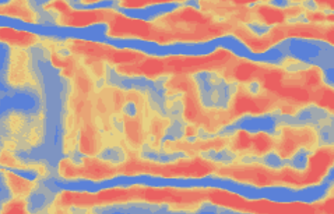
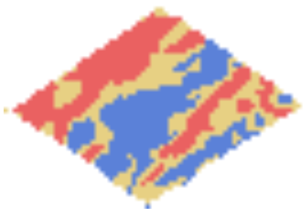
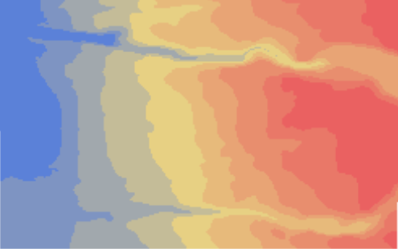
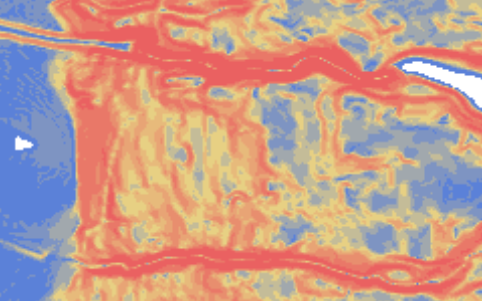
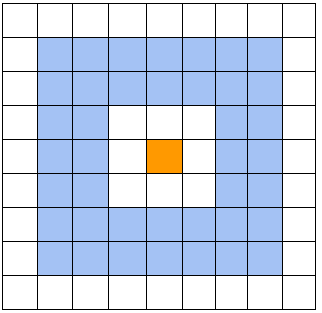
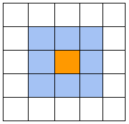
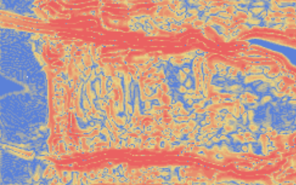

# Elevation Index API

The Elevation Index API offers a means of computing four elevation indices for an elevation raster that is passed to the service. The four indices are relative elevation, slope, topographic position index (TPI), and terrain ruggedness index (TRI). When using the API, the client can specify the particular indices that should be calculated for the elevation raster and there are options for a few tuning parameters relating to TPI and TRI. 

The intent behind the service is to provide farmers and producers with the ability to extract more information about the elevation of their field and the relationship with parameters such as wetness and yield. The correlation between these indices and yield is most often due to the way water is transported across sections of a farm field (i.e., correlation with chronically dry and wet areas). 

## Example

Below is an example POST request with the corresponding imagery that is generated by the service. The service requires a raster file be passed as a template for computing indices.

    files = [('elevation_raster',(open(rasterpath, 'rb')))]

    values = {'index_list':"['Slope, TRI, TPI, Relative_Elevation']",
            'Outside_Radius' :'5',
            'Inside_Radius':'3',
            'Search_Radius' :'7',
            'Legend_Range': '10'
    }

The response from the POST request.

    {'Slope': 'raster_Slope_46283.tif', 
    'features': [[{
    	'attributes': 
    	{'CellSize': [9.259259269220298e-05, -9.259259269220298e-05], 
    	'CoordinateSystem': 'GEOGCS["WGS 84",DATUM["WGS_1984",SPHEROID["WGS 84",6378137,298.257223563,AUTHORITY["EPSG","7030"]],AUTHORITY["EPSG","6326"]],PRIMEM["Greenwich",0],UNIT["degree",0.0174532925199433],AUTHORITY["EPSG","4326"]]', 
    	'Extent': '-72.4693823, 42.85850073332885, -72.46327118888232, 42.8626674', 
    	'Legend': [
    	    {'Area': '33.33 %', 
    	    'Count': 460, 
    	    'CountAllPixels': 1380, 
    	    'Max': 0.03123498149216175, 
    	    'Mean': 0.017523369751870632, 
    	    'Min': 0.0038117580115795135, 
    	    'color': '#4d76d5'}, 
    	    {'Area': '33.33 %', 
    	    'Count': 460, 
    	    'CountAllPixels': 1380, 
    	    'Max': 0.054506088296572365, 
    	    'Mean': 0.042870534894367054, 
    	    'Min': 0.03123498149216175, 
    	    'color': '#e5cc78'}, 
    	    {'Area': '33.33 %', 
    	    'Count': 460, 
    	    'CountAllPixels': 1380, 
    	    'Max': 0.1261863261461258, 
    	    'Mean': 0.09034620722134908, 
    	    'Min': 0.054506088296572365, 
    	    'color': '#e85454'}], 
    	'Matrix': [45, 66], 
    	'Max': 0.1261863261461258, 
    	'Mean': 0.04393044486641884, 
    	'Min': 0.0038117580115795135, 
    	'OID': 0, 
    	'Percentile5': 0.012359169591218234, 
    	'Percentile95': 0.07808069363236426, 
    	'Product': 'Slope', 
    	'Std': 0.021281977502967706, 
    	'Variety': 'NoVariety', 
    	'pngb64': 'data:image/png;base64, iVBORw0KGgoAAAANSUhEUgAAAEIAAAAtCAYAAAAa9r1nAAADU0lEQVR4nO1aO47bMBCdjXMFAQbcBerc+hruBHVbBtgTGOqCdIJPICClOkOdr+HWnZHOgAGdwUCqSUbcGXL4k1zkVd41zc/jmw+HBPiP18H90oz3SzMuOYcvSw4OAPCoqr8ELEnG21ID3y/NuGpv1jbrYShmms4yRFAVSHg2JQAAbHbtLGTMbho+JADMZy6zKUJDAMCUBAAAaj45TWUWRaQgwaefEHzN1TGA38RdJCD2h+sIAHA+bpOqI5siQndv1d5YEp5NOSELCUmF5D4ilIBnU4oEID5O7+xvU6gjKREhJJgmwUEigCKWjCSm8aiqMZcjQxK6uhfbdHUfHWajichJgIYE2n5/uAafWaKIiN0FySyoKWhIwHa/fv+AVXsL2pwgH6E5J7ig8Q0AOv/Q1f0nR+ubonsr4hVJsEGrDnVC9aiqERegTX5oSNQuXgskwBVyAf6RYUvRVaZBWeUWpJmMCyG7rx2XboZkKlZFmLLSLs7VTrNoCk7+GhK4NvdLM3JkiD5Ca1saf4ELpyFRCySB/k6rBPo//Ixh1kzRWUXEkGBOiJIQAjOXoGPaFKBRL1XHhIhYFWjOBTHwiVar9jaZD/5tmhmS8YYfYjPEXCRI0cHltE0SOFDnOYkaoTmCZA6hcEUHnzyE9mWrdk2cpW+hlNYIUqlAEyJtMOdB/342JayHoeDyiU/OEhtxuYMpPW7Qru6hq/ssPsIGzXi2jRbDJxISmhFqD0shMFUikYCbstm1hUvtqswST5l0At+//RQH10xSAqrJdpDi+pdUqC3YqM4ayCaay7MpAU6aX/pDQ4JNAfidb8XKq4q9HgZrmI1VA/Zhc5C2Pj9O78Elu+CaJU1RpazPhwgbAdocJaZuGXyvcT5ui/3hOmpSXxtsx2naVy4CEFGluvNxW2x2bcEpgZu4JpLQmoemr1QXPcnK+Vi4cZkD590lgmwEpL4lT3bTtR4GZ6zmIJmGRIImJwhB8rtP9B3cd+bOcyTYQmPOtxLZngVwUQVAri+4zCr1pa+JbJfAOHHO/jUkYHpM+8qJrM8Czsdt0dX8JRAtnEgXOjEJki9mezFzvzSjWR+QMNe7KYrZ3lBpFpcrImiwyKs67s50KQJeAku/tn0ZpH7+E4M/Z9MsQbsaOFIAAAAASUVORK5CYII='}}]]}

The png image returned in the POST response.

The GET request to retrieve the image using the 'FileName' from the POST response.

    https://ag-analytics.azure-api.net/elevation-index?filenames=raster_Slope_46283.tif

The image returned by the GET request.

## Request Options

| Parameter      | Data Type                    | Required? | Default | Options                                  | Description                                                                |
|----------------|------------------------------|-----------|---------|------------------------------------------|----------------------------------------------------------------------------|
| aoi            | GeoTIFF uploaded as binary   | Yes       | --      | --                                       | GeoTIFF raster to calculate indices for. Maximum area of 1.5 square miles. |
| index_list     | List of indices as a string. | Yes       | --      | "Relative_Elevation" "Slope" "TPI" "TRI" | Indices that should be calculated for the input GeoTIFF.                   |
| Outside_Radius | Integer as string            | No        | 3       | 0 < Outside_Radius < 20                      | Outer radius of window for computing TPI.                                  |
| Inside_Radius  | Integer as string            | No        | 1       | 0 <= Inside_Radius < Outside_Radius      | Inner radius of window for computing TPI.                                  |
| Search_Radius  | Integer as string            | No        | 1       | 0 < Search_Radius                        | Radius of window for computing TRI.                                        |
| Legend_Range   | Integer as string            | No        | 3       | 0 < Legend_Range                         | Number of ranges to display in png of output image.                        |

## Indices

### Relative Elevation

The relative elevation for a field is derived by calculating the z-score of every point in the field. This assigns a value to each point that says how far away from the mean it is. Unsurprisingly, this results in an identical image as the raw elevation data, however, the values are now relative to the rest of the field. Rather than using raw elevation data, which can be confounded by geospatial location (i.e., fields in Colorado are at a higher elevation than fields in Iowa) relative elevation is normalized by the mean elevation on the field.

### Slope

The maximum slope of each point on the field is calculated by taking the gradient of the elevation for each point. This is accomplished with a central finite difference scheme to compute the x and y derivatives at every point. 

By computing the maximum slope at every point, it is possible to tell whether a given point may be a place where water can pool or whether water will run off of it. One thing to note is that because the slope operation requires points beyond the point of interest, the raster was expanded by a single pixel that contained the same value as the edge pixels. These are called “ghost points” and ensure that the finite difference operation can be completed at every point in the raster. The method used here is edge replication, however, linear interpolation can also be used to generate ghost points.

### Topographic Position Index (TPI)

The topographic position index or TPI is a method of measuring the elevation of a given point with respect to a surrounding neighborhood of surrounding points. This index can be used to determine local extrema, or points of maximum and minimum elevation on a sub-field level. The index can be used to infer wet or dry areas of the field based on where water might pool or run off. The challenge with TPI is that the size of the search window or neighborhood is variable. The current implementation uses a ring search to calculate TPI, where the user can specify an outer bounding box and an inner bounding box between which the computation is done. 

For example in the diagram above, the center orange point is the point of interest and the blue area is the search neighborhood. In this case, the outer ring would have a dimension of 7x7, and the inner ring would have a dimension of 5x5. The ring dimensions are always odd numbers to ensure that the center pixel is actually in the center. Reference [Andrew D. Weiss, The Nature Conservancy].

### Terrain Ruggedness Index (TRI)

The TRI was developed by Riley et. al. in 1999 and is a means of calculating how rough a given area is in terms of local hilliness and steepness of gradients. This is done by constructing a window around each point in the raster and computing the mean of the squared differences of each window point and the central value. The TRI is then the square root of this mean value. The original paper specified a window of 8 pixels, however, the Elevation Index API leaves it up to the user.

